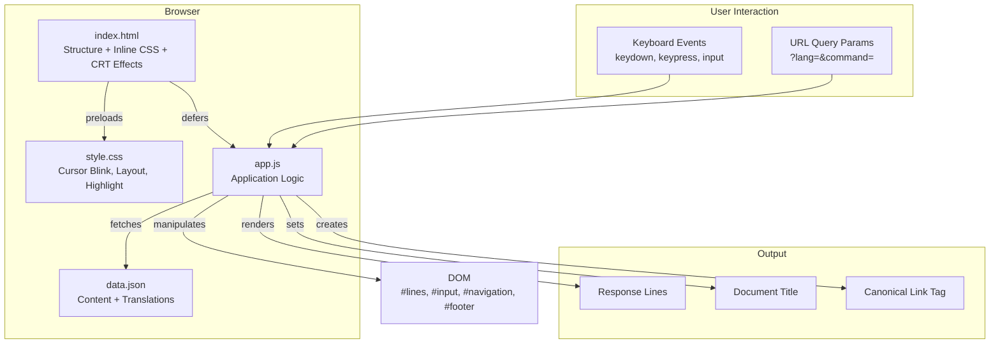

# Design Document: Console Homepage

## Overview

friscic.com is a personal homepage styled as a retro CRT terminal. The entire site is a static, client-side application consisting of four core files:

- `index.html` — page structure with inline critical CSS and CRT visual effects
- `app.js` — all application logic (input handling, command matching, translation, URL routing)
- `data.json` — all content and translations as a flat key-value JSON structure with `ref` support
- `style.css` — additional styles (cursor blink, layout, highlight classes)

The user interacts by typing commands into a terminal-style input field. The Command Processor matches input against keys in `data.json`, resolves references, translates text for the active language, and renders response lines into the DOM. The site supports bilingual content (EN/DE), URL-based deep linking, auto-typing animation, and performance-optimized static hosting on GitHub Pages.

No build step, no framework, no server-side logic. The architecture is intentionally minimal.

## Architecture



The architecture follows a single-page, event-driven pattern:

1. `index.html` loads with inline critical CSS for instant CRT rendering
2. `app.js` is deferred; on execution it fetches `data.json` and translates all entries for the active language
3. Three DOM event listeners (`keydown`, `keypress`, `input`) feed user input to `checkInput()`
4. `checkInput()` delegates to `inputValidator()` on Enter, which performs regex-based command matching against the translated content keys
5. Matched responses are rendered as new DOM elements in `#lines` via `newCommandLine()`
6. URL query parameters (`lang`, `command`) drive initial state: language selection and auto-command execution on page load

There is no routing library, no state management library, and no component framework. State is held in module-level variables (`content`, `eCnt`, `language`, `command`).

## Components and Interfaces

### 1. URL Parameter Parser (`getUrlSearchParams`)

Extracts `lang` and `command` from the URL query string. Returns `{ language: string, command: string | null }`. Defaults language to `"en"`.

### 2. Content Translator (`translate`)

Takes the raw JSON object from `data.json` and populates the `content` object. For each key, it:
- Resolves `ref` entries by looking up the referenced key and translating its entries
- Extracts the text value for the active language from bilingual `{ en, de }` text objects
- Preserves `href`, `highlight`, and other properties on each entry

**Interface:**
```
translate(json: Record<string, DataEntry[]>) → void
// Side effect: populates module-level `content` object
```

### 3. Command Processor (`checkInput` + `inputValidator`)

`checkInput(event, eventType)` handles all keyboard/input events:
- On Enter: echoes the command, calls `inputValidator()`, clears input
- On Backspace/deleteContentBackward: removes last character
- On character input: appends to displayed input

`inputValidator(inputString)` performs command matching:
- Iterates `Object.keys(content)` and matches with `new RegExp(^${command}, "gi")`
- If matched: renders all response entries for that key
- If empty input: escalates through EMPTY → CHEER → ANGRY based on `eCnt`
- If unrecognized: renders `'[input]' IS NOT RECOGNIZED`, resets `eCnt`

Special commands `CLS`/`CLEAR` and `ALL` have inline handling that clears `#lines` before rendering.

### 4. Response Renderer (`newCommandLine`)

Creates a new `<div>` in `#lines` with options:
- `text`: plain text content (with `%I` placeholder replacement)
- `href`: wraps content in an `<a>` tag with `target="_blank"`
- `highlight`: adds `.highlight` CSS class
- `collapsed`: sets `display: none`

After appending, smooth-scrolls to the bottom of the page.

### 5. Navigation Builder (`addNavigationItem`)

For each navigation section (ABOUT, TRAVEL, IMPRINT), creates an `<h2>` with an `<a>` linking to `?command={name}&lang={language}`. Link text is the translated first entry of that section.

### 6. Language Switcher (`addLanguageSwitch`)

Renders footer links for `en` and `de`. Each link preserves the current `command` parameter. The active language link gets the `.highlight` class.

### 7. Auto-Typer (`typeText` + `runOncePerDay`)

`runOncePerDay()` checks `localStorage.lastRun` against the current date string. If different, calls `typeText("Hello", { min: 500, max: 1000 })` which simulates character-by-character typing with randomized delays. Updates `lastRun` after execution.

### 8. Canonical Tag Setter (`setCanonicalTag`)

Creates a `<link rel="canonical">` element reflecting the current `lang` and optional `command` parameters.

## Data Models

### Data Store Structure (`data.json`)

```typescript
// Top-level structure
type DataStore = Record<string, DataEntry[]>;

// Each entry in a command's response array
type DataEntry = TextEntry | RefEntry;

interface TextEntry {
  text: { en: string; de: string };  // Bilingual text
  href?: string;                      // Optional link URL
  highlight?: boolean;                // Optional highlight flag
}

interface RefEntry {
  ref: string;  // Key in DataStore to resolve
}
```

### Translated Content (runtime)

```typescript
// After translate() processes data.json
type TranslatedContent = Record<string, TranslatedEntry[]>;

interface TranslatedEntry {
  text: string;          // Single-language text value
  href?: string;         // Preserved from source
  highlight?: boolean;   // Preserved from source
}
```

### Command Line Options

```typescript
interface CommandLineOptions {
  text?: string;       // Display text (%I replaced with user input)
  href?: string;       // Link URL (renders as <a> tag)
  highlight?: boolean; // Apply .highlight class
  collapsed?: boolean; // Set display: none
}
```

### Application State

```typescript
// Module-level state in app.js
const content: TranslatedContent = {};  // Populated by translate()
let eCnt: number = 0;                   // Empty input counter
const language: string;                 // From URL param, default "en"
const command: string | null;           // From URL param
```

### Navigation Enum

```typescript
const Navigation = {
  About: "ABOUT",
  Travel: "TRAVEL",
  Imprint: "IMPRINT"
};
```

### Language Enum

```typescript
const Language = {
  English: "en",
  Deutsch: "de"
};
```


## Correctness Properties

*A property is a characteristic or behavior that should hold true across all valid executions of a system — essentially, a formal statement about what the system should do. Properties serve as the bridge between human-readable specifications and machine-verifiable correctness guarantees.*

### Property 1: Character input appending

*For any* printable character received via a `keypress` or `input` event, the displayed input text should grow by exactly that character appended to the end.

**Validates: Requirements 2.2**

### Property 2: Enter clears input and echoes command

*For any* non-empty input string, when the user presses Enter, the output area should contain a new line with `~/[input_text]` and the Command_Input should be empty afterward.

**Validates: Requirements 2.3**

### Property 3: Backspace removes last character

*For any* non-empty input string, pressing Backspace should result in the displayed input text being the original string with the last character removed. For an empty input string, Backspace should leave it empty.

**Validates: Requirements 2.4**

### Property 4: Case-insensitive command matching

*For any* command key in the Data_Store and *for any* casing variation of that key (uppercase, lowercase, mixed), the Command_Processor should match it to the same command key.

**Validates: Requirements 3.1**

### Property 5: Command response renders all entries

*For any* matched command key, the number of new lines rendered in the output area should equal the number of response entries for that key in the translated content.

**Validates: Requirements 3.2**

### Property 6: Response entry rendering options

*For any* response entry with an `href` property, the rendered DOM element should contain an `<a>` tag with `target="_blank"` and the correct href. *For any* response entry with `highlight: true`, the rendered element should have the `.highlight` CSS class.

**Validates: Requirements 3.3, 3.4**

### Property 7: Placeholder replacement

*For any* user input string and *for any* response template containing the `%I` placeholder, the rendered text should contain the user's original input in place of every `%I` occurrence.

**Validates: Requirements 3.5, 13.5**

### Property 8: Unrecognized command response

*For any* non-empty input string that does not match any command key in the Data_Store, the output should contain `'[input]' IS NOT RECOGNIZED` and the Empty_Input_Counter should be reset to zero.

**Validates: Requirements 3.6, 4.4**

### Property 9: Empty input escalation

*For any* Empty_Input_Counter value greater than 2 and less than or equal to 10, submitting an empty command should display the CHEER emoticon with the counter value. *For any* counter value greater than 10, submitting an empty command should display the ANGRY emoticon with the counter value.

**Validates: Requirements 4.2, 4.3**

### Property 10: CLS/CLEAR clears output

*For any* prior output state (any number of previously rendered lines), submitting `CLS` or `CLEAR` should result in the output area containing only the clear confirmation response.

**Validates: Requirements 5.2**

### Property 11: ALL command lists all keys

*For any* Data_Store content, submitting `ALL` should produce output containing a comma-separated string that includes every key from the translated content object.

**Validates: Requirements 5.3**

### Property 12: Navigation link rendering

*For any* navigation section (ABOUT, TRAVEL, IMPRINT) and *for any* active language, the rendered navigation link should have an `href` containing `?command={section}&lang={language}` and the link text should equal the translated first entry text of that section.

**Validates: Requirements 6.1, 6.5**

### Property 13: Language determination from URL

*For any* URL query string, if the `lang` parameter is present and valid, the resolved language should equal that parameter value. If the `lang` parameter is absent, the resolved language should default to `"en"`.

**Validates: Requirements 7.1**

### Property 14: Translation extracts correct language text

*For any* Data_Store entry with a bilingual text object and *for any* active language (`en` or `de`), the translated text should equal the value at the active language key in the original bilingual object.

**Validates: Requirements 7.2**

### Property 15: Language switcher rendering

*For any* active language and *for any* current command parameter, the Language_Switcher should render links for both `en` and `de` that preserve the command parameter, and exactly the link matching the active language should have the `.highlight` class.

**Validates: Requirements 7.3, 7.4**

### Property 16: Data Store schema validation

*For any* key in the Data_Store, its value should be an array of objects. Each object should either have a `text` property (an object with `en` and `de` string keys) or a `ref` property (a string). Objects may optionally include `href` (string) and `highlight` (boolean) properties.

**Validates: Requirements 8.1, 8.2, 8.5**

### Property 17: Reference resolution equivalence

*For any* entry in the Data_Store that contains a `ref` property, the referenced key should exist in the Data_Store, and after translation, the content for the referencing key should be equivalent to the translated content of the referenced key.

**Validates: Requirements 8.3, 8.4**

### Property 18: Deep link auto-execution

*For any* valid command key present in the Data_Store, when the page loads with that command as the `command` URL parameter, the output area should contain the response entries for that command.

**Validates: Requirements 9.1, 9.2**

### Property 19: Deep link title update

*For any* valid command and *for any* active language, when a deep link is executed, the document title should contain the command name (or its translated equivalent) and the active language identifier.

**Validates: Requirements 9.3**

### Property 20: Canonical tag correctness

*For any* active language and *for any* optional command parameter, the canonical link tag `href` should equal `https://friscic.com/?lang={language}` with `&command={command}` appended when a command is present.

**Validates: Requirements 9.4**

### Property 21: Required commands exist in Data Store

*For all* commands in the required set (Linux: LS, PWD, MKDIR, MV, CP, RM, CAT, GREP, HEAD, TAIL, DIFF, SORT, TAR, CHMOD, CHOWN, KILL, DF, MOUNT, TOP, PS, SUDO, WHOAMI, UNAME, WHEREIS, WHATIS, USERADD, USERMOD, PASSWD, CD, TOUCH, ECHO, LESS, EXPORT, ALIAS, DD, CAL, SSH, APT, PACMAN, YUM, RPM, UFW, IPTABLES, WGET, TRACEROUTE; Windows: DIR, COPY, DEL, PING, TRACERT, FORMAT, CHKDSK, NSLOOKUP, SHUTDOWN, NETSTAT, NET, IPCONFIG; Site-specific: HELLO, HELP, CLS, CLEAR, ALL, AC, OOPS, IN, RND, SLEEPY, CHEER, ANGRY, ABOUT, ABOUT ME, TRAVEL, IMPRINT), the Data_Store should contain a key with a non-empty array of response entries.

**Validates: Requirements 13.1, 13.2, 13.3**

## Error Handling

### Invalid/Unrecognized Commands
When a user submits a non-empty string that doesn't match any command key, the system displays `'[input]' IS NOT RECOGNIZED`. This is the primary error path and is handled gracefully within the normal flow.

### Empty Input
Empty submissions are not treated as errors but as a playful interaction path with escalating emoticon responses (EMPTY → CHEER → ANGRY).

### Missing Event Data
If `checkInput` receives an event with no identifiable key/data (`eventId` is falsy), it displays the OOPS response (`(⊘_⊘）Oops...`).

### Fetch Failure
The `data.json` fetch uses `.then()` chaining without explicit error handling. If the fetch fails, the `content` object remains empty and all commands will produce "IS NOT RECOGNIZED" responses. The `.finally()` block still scrolls to bottom.

**Recommendation:** The current codebase lacks a `.catch()` handler on the fetch. A future improvement should display a user-friendly error message in the terminal output if `data.json` fails to load.

### Invalid Deep Link Command
If a `command` URL parameter references a key not in the Data_Store, the condition `content[command]` is falsy and the command is silently skipped — no error is shown, no title is updated. This is acceptable behavior.

### localStorage Unavailable
If `localStorage` is unavailable (private browsing in some browsers), `runOncePerDay` will throw. This is a minor edge case that could be wrapped in a try/catch.

## Testing Strategy

### Testing Framework

- **Unit/Example Tests:** Use a standard JavaScript testing framework (e.g., Jest or Vitest with jsdom environment) for DOM-dependent tests
- **Property-Based Tests:** Use [fast-check](https://github.com/dubzzz/fast-check) for property-based testing in JavaScript

### Unit Tests (Example-Based)

Unit tests should cover specific examples, edge cases, and integration points:

- **Requirement 4.1:** First empty submission (eCnt ≤ 2) shows the EMPTY shrug response
- **Requirement 5.1:** HELP command displays instructional text with "1-3" and "experimental"
- **Requirement 6.2–6.4:** ABOUT shows Xing/LinkedIn links; TRAVEL shows destination list; IMPRINT shows contact info
- **Requirement 10.1–10.3:** Auto-typer fires when lastRun differs from today, stores date after, skips when same
- **Requirement 11.1–11.3:** HTML contains inline `<style>`, preload link for style.css, defer on app.js script
- **Requirement 12.1–12.5:** CNAME, robots.txt, sitemap.xml, 404.html exist with expected content; meta tags present
- **Requirement 13.4:** RND command produces multiple emoticon face lines

### Property-Based Tests

Each property test must:
- Run a minimum of **100 iterations**
- Reference its design property with a tag comment: `// Feature: console-homepage, Property {N}: {title}`
- Be implemented as a **single** property-based test per correctness property
- Use fast-check arbitraries to generate random inputs

Key generators needed:
- **Arbitrary printable strings** for command input
- **Arbitrary casing variations** of known command keys
- **Arbitrary counter values** (integers 0–100) for escalation testing
- **Arbitrary language values** (`"en"` | `"de"`)
- **Arbitrary Data_Store entries** (bilingual text objects with optional href/highlight)
- **Arbitrary URL query strings** with lang/command parameters

### Test Organization

```
tests/
  unit/
    command-processor.test.js    — example tests for specific commands
    auto-typer.test.js           — localStorage and timing tests
    static-assets.test.js        — file existence and HTML structure checks
  property/
    input-handling.prop.test.js  — Properties 1, 2, 3
    command-matching.prop.test.js — Properties 4, 5, 7, 8
    rendering.prop.test.js       — Properties 6, 9, 10, 11
    navigation.prop.test.js      — Properties 12, 15
    translation.prop.test.js     — Properties 13, 14, 17
    data-store.prop.test.js      — Properties 16, 21
    deep-link.prop.test.js       — Properties 18, 19, 20
```
